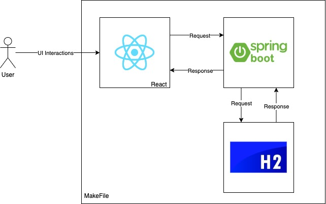

# WAM-CALC

**Version:** 0.1.0

## ELEC5619: GROUP 30
- Aditya Sengupta
- Aryan Bhatia
- Chang Zhao
- Hetush Gupta
- Kuan Li

## Summary
WAMCALC is a student portal focusing on Self - Academic Monitoring & Management. Additionally, it provides a platform for USYD students to easily calculate their WAM (including EIHWAM, SciWAM, Overall etc.).  

This repository stores the codebase and temporary database for WAMCALC. This project has been developed from a university project point of view, therefore, as of now it is not in a stable state for deployment. It is in a stable state to run on a local machine which was our assignment requirement.

## Dependencies
### Dependencies to install:
- [Node 14.15.5](https://nodejs.org/en/download/)
- [Spring Boot 2.7.3](https://start.spring.io/)
- [openjdk version 18.0.2.1](https://www.oracle.com/au/java/technologies/downloads/)

### Other dependencies:
#### Note: The user doesn't have to install these, they either come with spring, node or externally
- [Database: H2](https://www.baeldung.com/spring-boot-h2-database) 
- [External API](https://www.convertapi.com/pdf-to-txt) - [Reference](https://www.devglan.com/react-js/file-upload-react-spring-rest) 
- [Material UI 5.10.7](https://mui.com/) 
- jsonwebtoken 0.9.1 
- jakarta 2.3.2 
- convertapi 2.7 
- json-smart 2.4.8 

## Running the Application
We have created a make file to make the setup process easy for the user. The steps you need to follow to run the application on your local machine are:  
1. Install the "Dependencies to Install" mentioned above  
2. In the project root directory, run `make build` - this will install the node dependencies by essentially running npm install  
3. In the project root directory, run `make local` - this will run the Spring backend and the React frontend  
4. Head to [localhost:3000](http://localhost:3000/)  

## Running the Tests
Follow the steps below to run the test cases on your local machine:  
1. In the project root directory, run `make test` - this will run the test suite  
2. View the test results in the console/terminal  

## Summary of Features
The following list is a summary of features of this web application:  

A. Login/Sign-up Page:  
1. Sign-up by providing a username, email and password.  
2. Login to the web application by using your username and password.  

B. Home page:  
1. Start a semester by giving it a name.  
2. Within a semester, add units of studies with their code and name and enter your goal mark for that unit.  
3. Within a unit of study, add assessments related to that unit and enter the weight of a particular assessment.  
4. When received an assessment mark, update the assessment with that mark.  
5. Be able to delete any unit of study and/or assessment.  
6. Be able to see a coloured progress bar to see if you are on track to achieve your goal.  
7. When adding an assessment, be able to specify if it is a final exam or not.  
8. Be able to see the mark required in the final to reach the goal mark of a unit of study.  
9. Be able to end a semester and provide the overall mark achieved in a unit.  

C. WAM Calculator page:  
1. Upload pdf version of a transcript and specify the name and type of WAM desired.  
2. See the history of WAMs calculated in the history table.  

D. History Page:  
1. View a history of all the semesters and the units of studies done in them.  
2. Be able to see the overall mark, goal mark and difference for each unit within every semester.  
3. Be able to download csv or print a semester's record.  

E. Profile Page:  
1. View the latest WAM calculation.  
2. View the latest recorded semester.  
3. View the mark achieved in the finals for each unit last semester.  

## Repository Maintainers:
- Aryan Bhatia (abha6244@uni.sydney.edu.au)
- Aditya Sengupta (asen0038@uni.sydney.edu.au)
